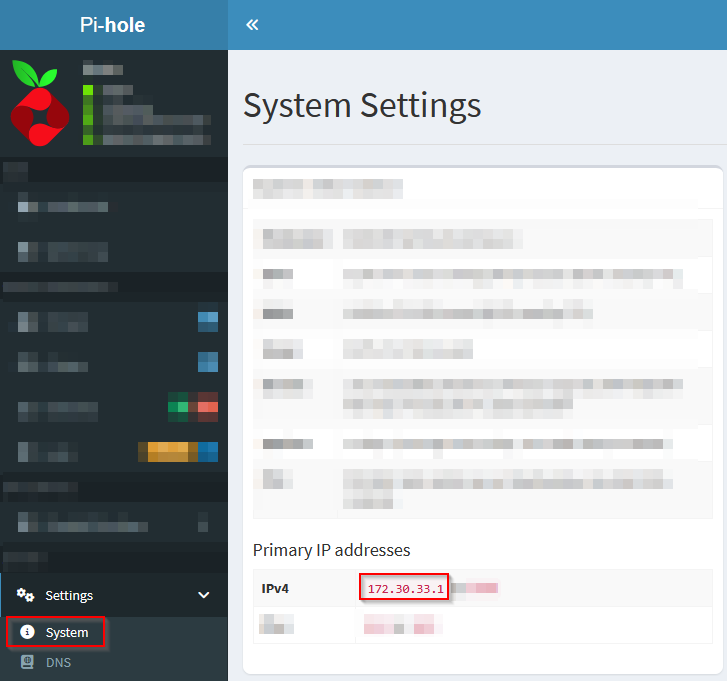

# Pi-hole for Home Assistant DHCP-helper

![version][version-shield]
![Supports amd64 architecture][amd64-shield]
![Supports aarch64 architecture][aarch64-shield]
![Supports armhf architecture][armhf-shield]
![Supports armv7 architecture][armv7-shield]
![Docker image size][image-size-shield]

This is a small helper add-on that forwards DHCP requests to a Pi-hole installation.

## Support

If you like the add-on and would like to support my work, you might [![Buy me a coffee][coffee-shield]][paypal]

## Installation

[![Open this add-on in your Home Assistant instance.][addon-shield]][addon]

1. Add [this](https://github.com/casperklein/homeassistant-addons-dev) Home Assistant add-ons repository to your Home Assistant instance or use the button above.
1. Install the Pi-hole-dhcp-helper add-on.
1. Start the add-on.

## Requirements

This add-on must be installed on the same Home Assistant instance as the Pi-hole add-on.

## Setup

### DHCP-helper

Get internal IP address of the Pi-hole addon:

   

Configure the IP address (e.g. `172.30.33.1`) in the add-on configuration as *internal IP address of the Pi-hole addon* and start the add-on.

### Pi-hole

By default, Pi-hole sends it's internal IP address as DNS server to the DHCP clients. However the internal IP address is not reachable for them.

We need to overwrite this with the IP address of Home Assistant, where Pi-hole is running.

In Pi-hole, go to *System / Settings / All settings / Miscellaneous* and look for `misc.dnsmasq_lines`. Add the following line:

    dhcp-option=option:dns-server,127.0.0.1

Replace `127.0.0.1` with your Home Assistant IP address.

[aarch64-shield]: https://img.shields.io/badge/aarch64-yes-blue.svg
[amd64-shield]: https://img.shields.io/badge/amd64-yes-blue.svg
[armhf-shield]: https://img.shields.io/badge/armhf-yes-blue.svg
[armv7-shield]: https://img.shields.io/badge/armv7-yes-blue.svg
[version-shield]: https://img.shields.io/badge/dynamic/json?color=blue&label=version&query=version&url=https%3A%2F%2Fraw.githubusercontent.com%2Fcasperklein%2Fhomeassistant-addons-dev%2Fmaster%2Fpi-hole-dhcp-helper%2Fconfig.json
[image-size-shield]: https://img.shields.io/docker/image-size/casperklein/homeassistant-pihole-dhcp-helper/latest
[addon-shield]: https://img.shields.io/badge/Show%20add--on%20on%20my-Home%20Assistant-blue?style=for-the-badge&logo=home-assistant

FIX ME

[addon]: https://my.home-assistant.io/redirect/supervisor_addon/?addon=83ea786c_pihole_dhcp_helper&repository_url=https%3A%2F%2Fgithub.com%2Fcasperklein%2Fhomeassistant-addons-dev

[coffee-shield]: https://img.shields.io/badge/Buy_me_a_coffee-blue?logo=paypal&color=blue
[paypal]: https://www.paypal.com/donate/?hosted_button_id=7C95GXVEQFE8C
